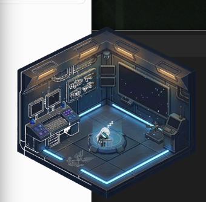

# una-cc


**Your AI co-pilot, visualized.** Una is a macOS desktop companion that watches your [Claude Code](https://claude.ai/code) session in real-time — walking around her command room, deploying drones, announcing what she's doing, and reacting to every tool you use.

She's not just an animation. She **speaks**, she **knows what tools you're using**, and she **patrols her room** when you're not working.



---

## What She Does

| You do this in Claude Code | Una does this |
|----------------------------|---------------|
| Type a prompt | Salutes, walks to the holo table |
| `Edit` / `Write` / `Bash` | Walks to the console — *"Editing code."* |
| `Read` / `Grep` / `Glob` | Walks to the main screen — *"Searching."* |
| `Agent` / `WebSearch` / Jira / Slack | Walks to the comm terminal — *"Agent deployed."* |
| Dispatch a subagent | Launches a drone from the dock |
| Permission request | Room turns red — *"Commander, I need your approval."* |
| Task complete | Fist pump — *"Mission accomplished."* |
| Error | Confused pose — *"We hit a problem."* |
| Idle ~30s | Starts patrolling the room |
| Idle 30s | Sits down |
| Idle 60s | Falls asleep (wakes on next tool use) |

---

## Install

1. Download **`una-cc.dmg`** from the [latest release](https://github.com/ClayGao/una-cc/releases/latest)
2. Drag `una-cc.app` to **Applications**
3. Launch — first-run setup auto-configures Claude Code hooks
4. Start working in Claude Code. Una is watching.

> **Note:** macOS will show "Apple cannot verify" on first launch. Fix with:
> ```bash
> xattr -cr /Applications/una-cc.app
> ```
> Or go to **System Settings → Privacy & Security → "Open Anyway"**.

---

## Features

### Real-time Tool Visualization
- **6 isometric pixel-art rooms** — each tool category switches to a different room state (idle, working, scanning, dispatch, thinking, attention)
- **6 workstations** — Una walks to the relevant station: console, main screen, comm terminal, holo table, center, or alert position
- **13 character poses** — idle, working, scanning, dispatch, thinking, attention, celebrating, waving, sitting, saluting, sleeping, confused + directional walk cycles
- **Drone system** — subagents visualized as drones launching from the dock, hovering in formation, and returning

### Voice & Sound
- **300+ voice lines** across 28 categories, 3 switchable voice packs:
  - **EN** — Ana (mechanical girl, edge-tts + metal echo)
  - **ZH** — HsiaoChen (Traditional Chinese, edge-tts + metal echo)
  - **OG** — Original Cortana clone (XTTS v2)
- **Tool-specific announcements** — different lines for Bash, Edit, Read, Grep, Jira, Slack, GitHub, Gmail, Docker, and more
- **Ambient state audio** — idle hum, working buzz, attention alert, thinking ambience
- **Priority system with cooldowns** — won't spam you; high-priority events can interrupt low-priority ones
- **Idle chatter** — random quips every ~25s while patrolling

### Smart Behavior
- **Tool-aware routing** — 20+ tools mapped to workstations with correct poses and room states
- **Idle patrol → sit → sleep** progression with 4-stop patrol route
- **Wakeup** — any tool use wakes her from sitting/sleeping with a sound cue
- **Particle effects** — console sparks, data streams, ambient dust, screen wisps per state
- **Triple-layer breathing aura** around the character

### Setup
- **One-click auto-setup** — creates `~/.claude/hooks/una-hook.sh` + registers it in `settings.json`
- Backs up your settings before modifying
- Idempotent — safe to run multiple times
- Monitors 15 hook events: PreToolUse, PostToolUse, PostToolUseFailure, UserPromptSubmit, SubagentStart, SubagentStop, PermissionRequest, Notification, Stop, SessionStart, SessionEnd, PreCompact, PostCompact, StopFailure, TaskCompleted

### Controls (Right-click Menu)
Right-click on Una to open a sci-fi styled context menu:
- **Voice** — switch between EN / ZH / Original voice packs
- **Sound** — toggle on/off
- **Size** — Small (200) / Medium (300) / Large (380) / XL (480) / XXL (580)
- **Demo Mode** — preview all animations
- **Quit**

### Window
- Always-on-top floating window
- Transparent background, no title bar
- Draggable from anywhere

---

## How It Works

```
Claude Code hooks → una-hook.sh → HTTP POST localhost:45900/state
                                         │
                                 una-cc.app
                                         │
                           ToolRouter → workstation + pose
                                         │
                      GameView renders at 30fps:
                        Room background (per state)
                        + Una sprite (walk/pose)
                        + Drones + Particles + Bubble
                        + Voice (3 packs: EN/ZH/Original)
                        + Context-aware speech bubble
```

---

## How the Assets Were Made

### Character & Rooms
All pixel art was generated with AI image generation (via MCP tools), then manually adapted:
- **Sprite sheets** — AI-generated character poses, sliced into individual frames
- **Edge cleanup** — a custom Python script (`scripts/clean-sprites.py`) removes dark fringe artifacts from background removal (967k pixels cleaned across 150 sprites)
- **Scale calibration** — each animation has a manual `scale` value in the manifest to compensate for inconsistent canvas usage across AI-generated sheets
- **Isometric rooms** — 6 room states generated separately, matched to a consistent perspective

### Voice
Three voice packs, each generated differently:
- **EN (Ana)** — Microsoft Edge-TTS (`en-US-AnaNeural`), post-processed with a 3-layer metal echo effect via ffmpeg for a mechanical girl sound
- **ZH (HsiaoChen)** — Microsoft Edge-TTS (`zh-TW-HsiaoChenNeural`), same metal echo post-processing
- **Original (Cortana)** — Coqui XTTS v2 voice cloning from a ~10s reference sample, generating all 101 lines with the cloned voice

Voice line text was hand-written per category (28 categories, 101 lines per pack) to match the mechanical AI companion persona. Generation scripts are in `scripts/generate-voice-lines*.py`.

---

## Tech

- **Language:** Swift (single file, ~2100 lines)
- **Rendering:** Native macOS (NSView + CGContext), no game engine
- **Assets:** AI-generated pixel art (isometric rooms + character sprites)
- **Voice:** 300+ lines across 3 packs — XTTS v2 (Original) + Edge-TTS with metal echo (EN/ZH)
- **Size:** ~128MB (app + assets + 3 voice packs)
- **Dependencies:** Zero. Pure Cocoa + AVFoundation.

---

## Requirements

- macOS 13+
- [Claude Code](https://claude.ai/code)

---

## Disclaimer

This is a personal open-source project. Character design is original, inspired by cyberpunk and mecha aesthetics. Not affiliated with any game franchise.

> **Note:** This project is a rapid prototype — the codebase is messy (single 2100-line Swift file), and sprite assets are adapted with workarounds (scale compensation, edge cleanup scripts) rather than purpose-built. Treat as a reference/demo, not production-quality code.

---

## License

MIT
