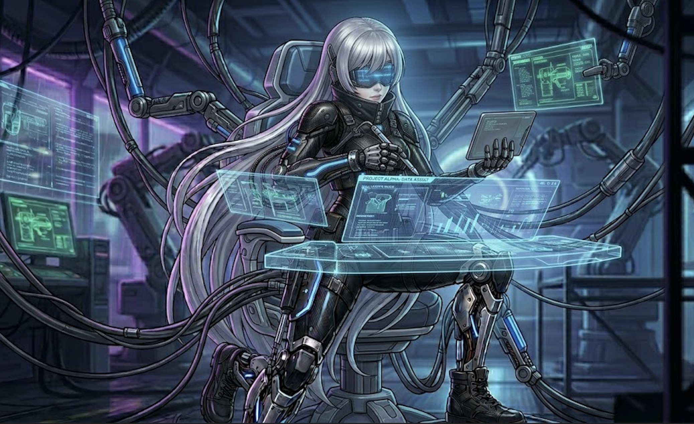
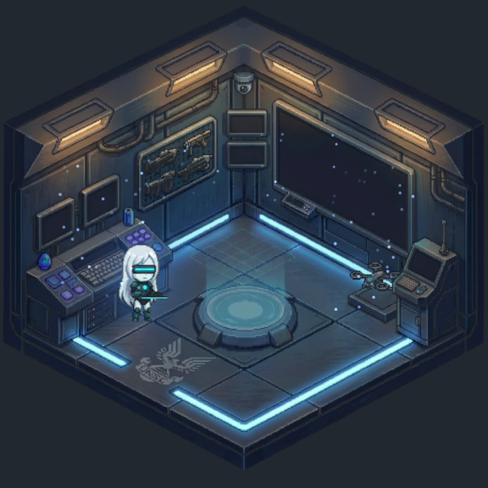

# Una Companion



**Your AI co-pilot, visualized.** Una is a macOS desktop companion that watches your [Claude Code](https://claude.ai/code) session in real-time — walking around her command room, deploying drones, announcing what she's doing, and reacting to every tool you use.

She's not just an animation. She **speaks**, she **knows what tools you're using**, and she **patrols her room** when you're not working.



---

## What She Does

| You do this in Claude Code | Una does this |
|----------------------------|---------------|
| Type a prompt | Salutes, walks to the holo table |
| `Edit` / `Write` / `Bash` | Walks to the console — *"Editing code."* |
| `Read` / `Grep` / `Glob` | Walks to the main screen — *"Searching."* |
| `Agent` / `WebSearch` / Jira / Slack | Walks to the comm terminal — *"Agent deployed."* |
| Dispatch a subagent | Launches a drone from the dock |
| Permission request | Room turns red — *"Commander, I need your approval."* |
| Task complete | Fist pump — *"Mission accomplished."* |
| Error | Confused pose — *"We hit a problem."* |
| Idle 8s | Starts patrolling the room |
| Idle 30s | Sits down |
| Idle 60s | Falls asleep (wakes on next tool use) |

---

## Install

1. Download **`UnaCompanion.dmg`** from the [latest release](https://github.com/ClayGao/una-cc/releases/latest)
2. Drag `UnaCompanion.app` to **Applications**
3. Launch — first-run setup auto-configures Claude Code hooks
4. Start working in Claude Code. Una is watching.

> **Note:** macOS may block unsigned apps. Right-click → Open to bypass Gatekeeper.

---

## Features

### Real-time Tool Visualization
- **6 isometric pixel-art rooms** — each tool category switches to a different room state (idle, working, scanning, dispatch, thinking, attention)
- **6 workstations** — Una walks to the relevant station: console, main screen, comm terminal, holo table, center, or alert position
- **13 character poses** — idle, working, scanning, dispatch, thinking, attention, celebrating, waving, sitting, saluting, sleeping, confused + directional walk cycles
- **Drone system** — subagents visualized as drones launching from the dock, hovering in formation, and returning

### Voice & Sound
- **97+ pre-recorded voice lines** across 22 categories
- **Tool-specific announcements** — different lines for Bash, Edit, Read, Grep, Jira, Slack, GitHub, Gmail, Docker, and more
- **Ambient state audio** — idle hum, working buzz, attention alert, thinking ambience
- **Typing SFX** during edit/write actions
- **Priority system with cooldowns** — won't spam you; high-priority events can interrupt low-priority ones
- **Idle chatter** — random quips every ~25s while patrolling

### Smart Behavior
- **Tool-aware routing** — 20+ tools mapped to workstations with correct poses and room states
- **Idle patrol → sit → sleep** progression with 4-stop patrol route
- **Wakeup** — any tool use wakes her from sitting/sleeping with a sound cue
- **Particle effects** — console sparks, data streams, ambient dust, screen wisps per state
- **Triple-layer breathing aura** around the character

### Setup
- **One-click auto-setup** — creates `~/.claude/hooks/una-hook.sh` + registers it in `settings.json`
- Backs up your settings before modifying
- Idempotent — safe to run multiple times
- Monitors 10 hook events: PreToolUse, PostToolUse, PermissionRequest, UserPromptSubmit, TaskCompleted, TaskCreate, SubagentStart, SubagentStop, PostToolUseFailure, Notification

### Controls (Menu Bar)
- **Size:** Small (200) / Medium (300) / Large (380) / XL (480) / XXL (580)
- **Sound:** Toggle on/off (S)
- **Demo Mode** (D)
- **Quit** (Q)

### Window
- Always-on-top floating window
- Transparent background, no title bar
- Draggable from anywhere

---

## How It Works

```
Claude Code hooks → una-hook.sh → HTTP POST localhost:45900/state
                                         │
                                 UnaCompanion.app
                                         │
                           ToolRouter → workstation + pose
                                         │
                      GameView renders at 30fps:
                        Room background (per state)
                        + Una sprite (walk/pose)
                        + Drones + Particles + Bubble
                        + Voice (pre-recorded WAV)
```

---

## Tech

- **Language:** Swift (single file, ~1500 lines)
- **Rendering:** Native macOS (NSView + CGContext), no game engine
- **Assets:** AI-generated pixel art (isometric rooms + character sprites)
- **Voice:** Pre-generated with XTTS v2, 97+ lines across 22 categories
- **Size:** ~20MB (app + assets + voice)
- **Dependencies:** Zero. Pure Cocoa + AVFoundation.

---

## Requirements

- macOS 13+
- [Claude Code](https://claude.ai/code)

---

## Disclaimer

This is a personal open-source project. Character design is original, inspired by cyberpunk and mecha aesthetics. Not affiliated with any game franchise.

---

## License

MIT
